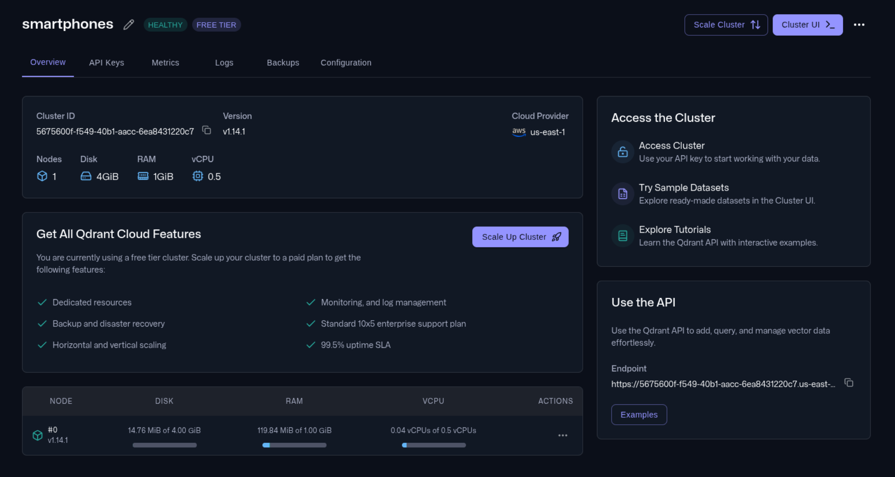
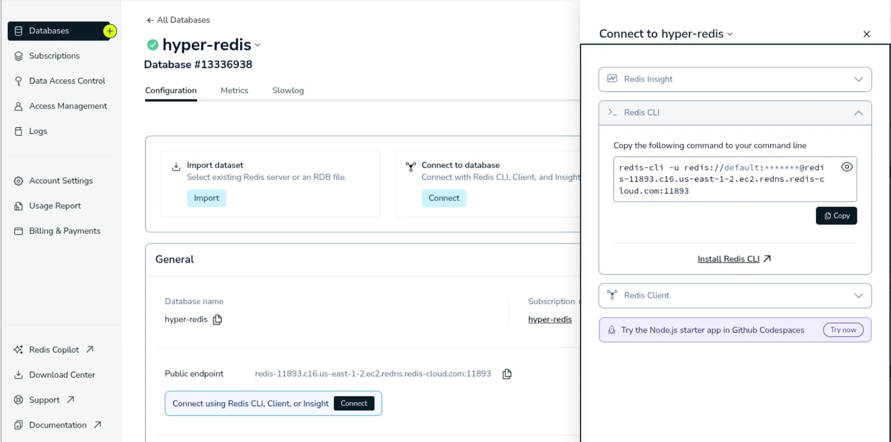
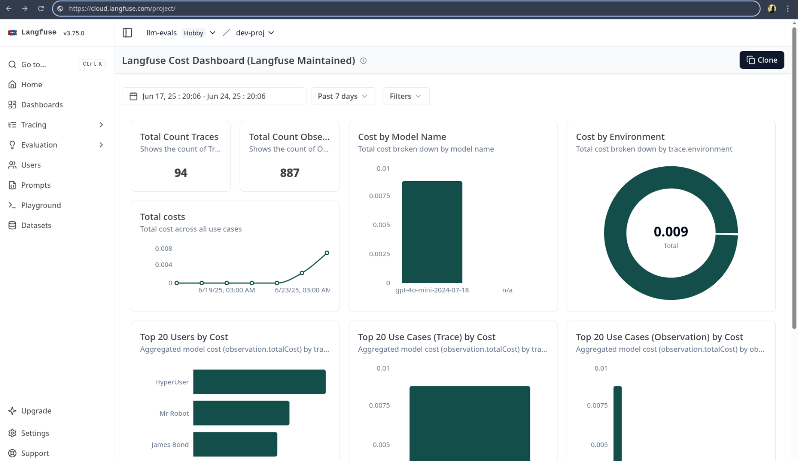

## **Refactoring to Cloud Services**

## **Table of Contents**

- [Description](#description)
- [Recommended Development Steps](#recommended-development-steps)
- [Deliverables](#deliverables)

### **Description**

So far,your application has been communicating locally with various services and components—your vector and Redis databases, as well as Langfuse. Since you're doing everything locally in your development environment, communication is easy — your app can just access them over your local network. However, moving to a production environment, this may not be possible (unless you host them in your on-prem servers). Additionally, you need to handle aspects such as scaling and fault tolerance as you'll, hopefully, be receiving a lot of traffic from customers.

If you don't have the infrastructure to run services locally, you would use cloud services, which come in many flavors. You can use a public cloud like AWS or Azure and create instances for your infrastructure. This gives you the most control, but the setup process and maintenance can be complex.

On the other hand, you can utilize SaaS (Software as a Service) and PaaS (Platform as a Service) solutions. These allow you to access cloud services without doing much of the heavy lifting. Your PaaS provider will handle managing the infrastructure, upgrades, scaling, patches, and other tasks.  While these cloud models are easy to set up, you have no control over the platform. This may not be ideal for data-sensitive workloads.

### **Recommended Development Steps**

In this stage, you'll refactor your app to use cloud services instead of the local setup we've been using so far. Note that it is possible to move our entire setup to a public cloud, such as using AWS EC2 instances and Docker containers. However, to keep the setup simple, we will use managed services. We’ll use Qdrant Cloud, Redis Cloud, and Langfuse Cloud. For the Litellm proxy, we’ll use EC2 instances later. If you want, you can try experimenting with a cloud provider like [Render](https://render.com/deploy?repo=https://github.com/BerriAI/litellm).

Once you’ve created accounts on those platforms ([Qdrant](https://cloud.qdrant.io/), [Redis](https://redis.io/cloud/), [Langfuse](https://cloud.langfuse.com/)) the next step is to set things up. For Qdrant, start by creating a free tier cluster:



Next, can generate an API key and note the endpoint URL you will use for the Qdrant client. Now that you have the cluster, you need to upload your data. When you run the application for the first time, the `embed_documents()` function will create the store for you. Alternatively, you can create a snapshot from your local installation and upload it via the cluster UI. Then, update your `embed_documents()` function to retain only the necessary parts:

```python
collection_exists = qdrant_client.collection_exists(collection_name=collection_name)
if collection_exists:
  qdrant_store = QdrantVectorStore.from_existing_collection(
        url=os.environ["QDRANT_URL"],
        api_key=os.environ["QDRANT_API_KEY"],
        embedding=embeddings_model,
        collection_name=collection_name,
    )

    return qdrant_store
```

For Redis, all you need to do is create a database. Then, click “Connect” to see various ways to connect to the database:



One way is to use the database connection string that looks like this:

```bash
redis://<username>:<password>@<public_endpoint>:<port>/<database>
```

You can view it in full from the Redis CLI connection method (use database `0`). Then, use it in your code:

```python
REDIS_URL = os.environ["REDIS_CONN_STRING"]

def get_redis_history(session_id: str) -> BaseChatMessageHistory:
    return RedisChatMessageHistory(session_id, redis_url=REDIS_URL, ttl=3600)
```

Using a database client, you can see the chat history in your Redis database. Finally, for Langfuse, all you need to do is create a new organization, project, and generate public and private keys. Then, set the `LANGFUSE_HOST` key to `https://cloud.langfuse.com`. You should now see traces in your Langfuse cloud instance:



### **Deliverables**

At this point, your application should be using cloud providers for your vector and Redis databases, as well as Langfuse.
