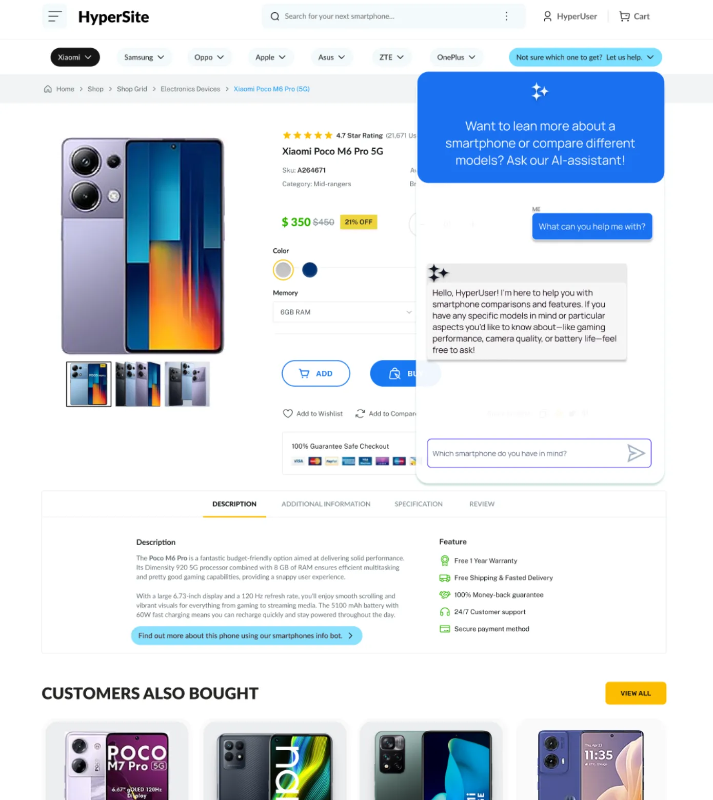

## **API Endpoint**

## **Table of Contents**

- [Description](#description)
- [Recommended Development Steps](#recommended-development-steps)
- [Deliverables](#deliverables)
- [Useful Resources](#useful-resources)
    - [Topics](#topics)

### **Description**

Usually, we want to integrate AI capabilities into our existing applications. Imagine that the frontend team has already created the UI:



Also, the backend team has added the remaining application logic, enabling users to create accounts, order smartphones, and access other features. During sign-up, users are also assigned keys in LiteLLM behind the scenes. This ensures they already have an LLM usage budget linked to their account.

Now, they're collaborating with you, the AI team, to integrate an AI-powered assistant to help users choose the best smartphone. What you've been building is like a microservice in a larger web application. It is decoupled from the main application, meaning it can be developed and deployed independently. The main application communicates with this application only via a REST API.

Therefore, we need to implement the API endpoint to which the main application can send requests. When a user asks a question, a POST request is sent to the endpoint with the user’s query, user ID, and session ID. Once the response is generated, it will be displayed to the user in the frontend UI.

### **Recommended Development Steps**

Your task is to use FastAPI to implement the API endpoint `/ask`. The application should remain the same (monitoring, evaluations, guardrails, and budgets all remain unchanged). However, instead of sending queries using the CLI, the application should run as a web service that we can send requests to and receive responses:

```python

if __name__ == "__main__":
    uvicorn.run("main:app", host="0.0.0.0", port=8000, reload=True)
```

You should use the following Pydantic schema for the request:

```python
class QueryRequest(BaseModel):
    user_input: str
    user_id: str
    session_id: str
```

This schema will be used to validate the incoming request. These parameters are required to identify the user and the session, helping the LLM provide personalized responses. Also, these parameters are useful for user history retrieval and usage tracking in LiteLLM. The user ID and session ID are collected by the main application, and the user input from the text input form. You don’t need to implement this logic.

Another thing to note is that some aspects of the application will no longer be required. For example, you don't need the EndSession tool anymore. You can remove that, as well as the generation of goodbye messages. The LLM only needs one tool now, the `SmartphonesInfo` tool. Also, ensure you're building the vector store when that tool is called.

### **Deliverables**

In this task, your application should run as a web service that accepts POST requests and returns responses containing the LLM's recommendations. Therefore, your repo should contain the updated code that adds this functionality.

### **Useful Resources**

### **Topics**

If you’re new to a topic, you might also want to go over the prerequisite topics.

- [Overview of FastAPI](https://hyperskill.org/learn/step/52311).
- [Introduction to Pydantic](https://hyperskill.org/learn/step/52212)
