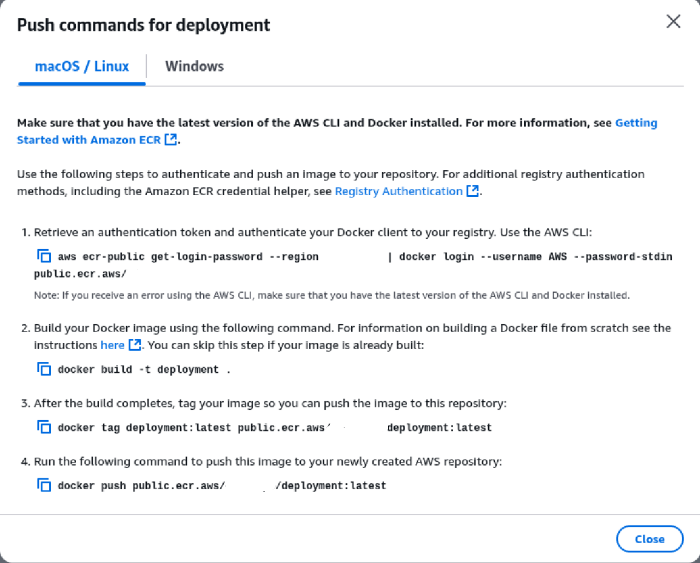

## **Deployment to AWS**

## **Table of Contents**

- [Description](#description)
- [Recommended Development Steps](#recommended-development-steps)
- [Deliverables](#deliverables)
- [Useful Resources](#useful-resources)
    - [Topics](#topics)
    - [Docs](#docs)
    - [Other useful articles](#other-useful-articles)

### **Description**

With a production-ready Docker image built, let’s move it to production! In this final task, your task is to deploy it to the cloud. There are multiple ways we can do this on AWS. Other cloud providers have similar services, so once you understand how to do it on AWS, you’ll be ready to deploy on other platforms as well.

Here, we will run the application on an AWS EC2 instance. In that instance, we will run the Docker Engine and use it to run the image. You can use a suitable container registry like [Amazon Container Registry (ECR)](https://aws.amazon.com/ecr/getting-started/) or [Docker Hub](https://hub.docker.com/)   to store the Docker image in a public repository. We will also explore more advanced deployment patterns for when your application needs to handle higher traffic and requires greater availability.

### **Recommended Development Steps**

To complete this task, you need an AWS account. Once you have an account, here are some security and other best practices to perform next:

- Set up a [zero-spend budget](https://docs.aws.amazon.com/cost-management/latest/userguide/budget-templates.html). This ensures that you’re immediately alerted in case you left some services running. (but it doesn’t stop services; you have to do that yourself)
- Never use the root user account. Head over to AWS IAM service console and set up an IAM user with the `AdministratorAccess` policy. You will use this account for administrative actions.
- Set up MFA for the root user. This can also be done from the AWS IAM service console.
- You can also set up other users with minimal permissions for various tasks.

Now that you have a non-root user, log out and log in as the IAM user. Then, generate access keys that you will use to authenticate the [AWS CLI](https://aws.amazon.com/cli/). You will use the AWS CLI to push images to Amazon ECR. However, if you used a different container registry, such as Docker Hub or Google Container Registry, you do not need the AWS CLI.

If you decide to use Amazon ECR, just create a public repository in the Amazon ECR service. Using a public repo ensures that you do not incur charges because private repos have a 500MB image size limit (and for us to access it).

Next, you need to upload the container image to Amazon ECR (or the registry of choice). Since significant changes require rebuilding the image and uploading, ensure you have thoroughly tested the image and that it works as expected locally. Once you’re satisfied, check your Amazon ECR repository to find the necessary commands you need to push the image:



For Docker Hub, you would use:

```bash
docker login
docker build -t <image>:<tag> .
docker tag <image>:<tag> <repo>/<image>:<tag>
docker push <repo>/<image>:<tag>
```

### Using EC2 Instances

Once your image is uploaded, the next step is to launch an AWS EC2 instance where you’ll run the container. Here are some key configs for the instance:

- Use a Linux-based image such as Ubuntu, Debian, or Amazon Linux.
- For instance, type, select a free-tier eligible instance type, which can be `t2.micro` or `t3.micro`, depending on the selected region.
- Create a new key pair — you’ll use this to `SSH` into the instance.
- For Network settings, check options to enable SSH, HTTPS, and HTTP traffic for the new security group. This will allow you to connect to the server via SSH and access the app via HTTP.
- You can leave the other options as default.

Wait for a few minutes for the instance to be launched and for [status checks](https://docs.aws.amazon.com/AWSEC2/latest/UserGuide/monitoring-system-instance-status-check.html) to pass. Then, head over to the `Connect` page and follow the instructions to connect via SSH or EC2 Instance Connect. For SSH, you may need to set up permissions for the key pair (if necessary). You will also find the command to connect to the instance (note that the public IP changes when the instance is restarted):

```bash
ssh -i /path/to/your-key.pem <username>@<YOUR_EC2_PUBLIC_IP>
```

Once you connect to the instance, you need to install and run the Docker Engine. You may have been using Docker Desktop so far, but in production environments, you use the Docker Engine. The [installation instructions](https://docs.docker.com/engine/install/) vary depending on the OS image you selected earlier. You might also need to perform some [post-installation](https://docs.docker.com/engine/install/linux-postinstall/) steps to avoid running Docker with `sudo`:

```bash
sudo groupadd docker # create a new group (it may already exist)
sudo usermod -aG docker $USER # and the currently logged in user to the group
newgrp docker # to activate changes but you may need to restart the VM if you still can't run docker without sudo
```

Great, with Docker installed, you would then pull the image from your repository and run it. Alternatively, you can clone your repo and build the image as you did locally. As for the `.env` file, just create one using a text editor like `nano` or `vim` and copy your variables there. Then, run the image using the following command:

```bash
docker run \
  -d \ # remove this to see the application startup progress because it may take a while 
  -p 80:8000 \
  --name hypersite \
  --restart always \
  --env-file ./.env \
  <image_name> # e.g. public.ecr.aws/q9c7y1p3/deployment:latest
```

This command starts your container in the background (using `-d`), maps port 80 on the host to port 8000 in the container (`-p 80:8000`), and gives it the name `hypersite` (`--name hypersite`).  `--restart always` sets the restart policy to `always`, so Docker will automatically restart the container if it crashes or if the daemon restarts, and loads environment variables from the file `./.env` (`--env-file ./.env`). The <image_name> is your container registry image.

That’s it! The application should now be accessible via the public IP from anywhere in the world. You can try viewing the API docs here:

```bash
http://<ec2-public-ip>/docs
```

As an optional step, try to run the LiteLLM proxy using a dedicated AWS EC2 instance. You can run it exactly as we did before. That involved creating the `config.yaml` file and modifying the `docker-compose.yml` file. You can also try using the [CloudFormation Stack or EKS](https://docs.litellm.ai/docs/proxy/deploy#platform-specific-guide), because a single instance may not be enough to run both the proxy and database servers.

Once deployed, you would then create users and virtual keys for the new LiteLLM proxy instance as we did before. Once you are done, you can now use the following base URL (you can use this from your local environment as well):

```markdown
http://<ec2-public-ip>:4000
```

### Other Alternatives

Deploying to a single EC2 instance is a great start. However, it may not be ideal when you start receiving many requests. Here are more advanced, production-grade patterns for when you need to scale.

1. **EC2 behind a Load Balancer**

An Application Load Balancer (ALB) distributes incoming traffic across multiple EC2 instances, each running a copy of your container. It offers high availability (survives an instance failure), horizontal scalability (add more instances to handle more traffic), and easy-to-manage SSL certificates.

2. **Serverless with AWS Lambda and API Gateway**

Your FastAPI application is packaged into a special format (using a tool like Mangum) and deployed as an AWS Lambda function. An API Gateway endpoint is created to trigger the function via HTTP requests. This approach is fully managed (no servers to patch or maintain), pay-per-use pricing, automatic scaling. Very useful for APIs with infrequent or unpredictable traffic, or for teams that want to minimize infrastructure management.

3. **Container Orchestration with ECS or EKS**

Use a container orchestrator like   Amazon ECS   (Elastic Container Service) or   EKS   (Elastic Kubernetes Service) to manage your container deployments. With   AWS ****Fargate   as a launch type for ECS, you don't even need to manage the underlying EC2 instances.

This approach is the most robust and flexible option. It manages deployments, scaling, service discovery, and container health automatically. It is useful for complex applications, microservices architectures, and high-traffic environments that require robust, automated operational control.

### **Deliverables**

You have completed this task when:

1. Your Docker image is stored in a public container registry.
2. An EC2 instance is running and configured with a security group allowing web traffic.
3. The Docker container is running on the EC2 instance and is accessible to the public internet via the instance's IP address.
4. The web app is accessible from the internet and we can send requests to it.

### **Useful Resources**

### **Topics**
If you're new to AWS, you can start with the following topics on Hyperskill and their prerequisites:
- [The AWS Management Console](https://hyperskill.org/learn/step/39474)
- [EC2 Basics](https://hyperskill.org/learn/step/41843)
- [Launching an EC2 Instance](https://hyperskill.org/learn/step/45458)
- [Connecting to an EC2 Instance](https://hyperskill.org/learn/step/47674)
- [Introduction to Serverless Computing](https://hyperskill.org/learn/step/47673)
### **Docs**

- [AWS Free Tier](https://aws.amazon.com/free/)
- [Getting started WITH Amazon ECR](https://aws.amazon.com/ecr/getting-started/)
- [Deploying a FastAPI App to AWS Lambda](https://mangum.fastapiexpert.com/)
- [Build and push your first image](https://docs.docker.com/get-started/introduction/build-and-push-first-image/)